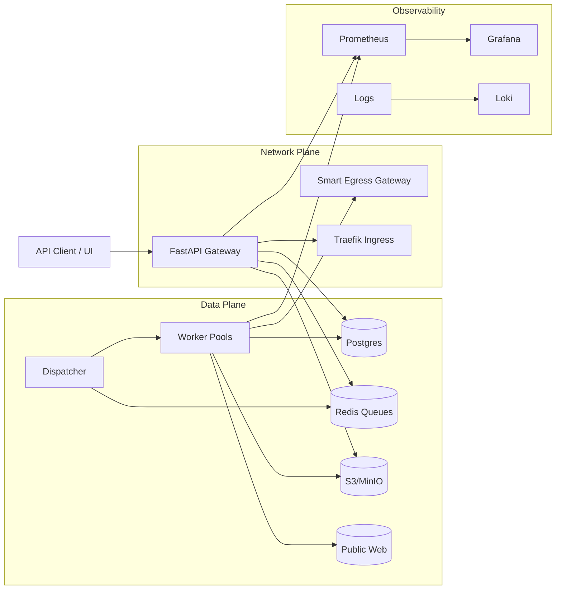
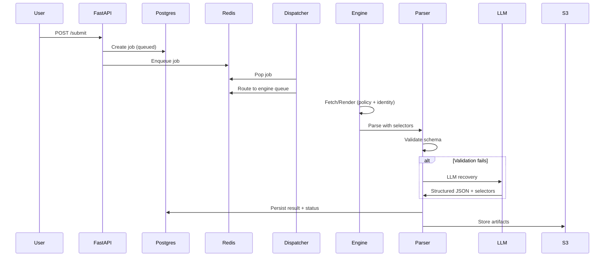

# Proteus-Scraper: Architecture

This document describes the system architecture, runtime flows, and operational boundaries for Proteus-Scraper. It complements `project-overview.md` with component-level detail.

## Design Principles
- Selector-first extraction, AI only on failure.
- Deterministic, validated outputs with explicit failure reasons.
- Policy enforcement (rate limits, circuit breakers, budgets) at runtime.
- Database-driven configuration; no hardcoded selectors.
- Separation between control plane (API) and data plane (workers).

## System Context


## Architecture Layers

### Control Plane
- API Gateway: job submission, status, results, schema registry, preview.
- Dispatcher: routes jobs to engine queues based on URL signals.
- Config Registry: selectors, proxy policies, identity pools.

### Data Plane
- FastEngine: async HTTP fetcher (httpx) for static HTML.
- StealthEngine: optional curl_cffi fetcher for TLS/JA3-sensitive targets.
- BrowserEngine: Playwright for JS-rendered pages.
- Hybrid Parser: selectors first, LLM fallback on validation failure.
- Artifact Storage: HTML, screenshots, HAR stored in S3/MinIO or local.

### Governance Plane
- Global rate limits and circuit breakers per domain.
- LLM budget caps per job and per tenant.

### Identity Plane
- Encrypted cookie jar and fingerprint pools per tenant.
- Usage/failure-based rotation and deactivation.

### Infrastructure Plane
- Egress gateway for proxy routing.
- Traefik ingress for API/UI routing.
- Prometheus + Grafana + Loki for observability.

## Component Responsibilities
| Component | Responsibility |
| --- | --- |
| API Gateway | Auth, validation, job creation, status, results, preview |
| Dispatcher | Routing decisions and queue placement |
| Engine Workers | Fetch, render, parse, artifact capture |
| Hybrid Parser | Selector parse, LLM fallback, revalidation |
| Identity Service | Cookie vault, fingerprints, rotation |
| Governance | Rate limits, circuit breakers, LLM budgets |
| Proxy Policy | Per-domain proxy decisions |
| Observability | Metrics, logs, dashboards |

## Job Lifecycle (Sequence)


## Engine Behavior
- FastEngine: uses httpx with optional proxy and identity headers/cookies.
- StealthEngine: uses curl_cffi when stronger TLS/JA3 mimicry is required.
- BrowserEngine: uses Playwright contexts, applies identity and captures HAR/screenshot.
- Both engines pass HTML into the same parser and LLM recovery path.

## Target Routing and Escalation (Standard)
- Tier order: fast (httpx) -> stealth (curl_cffi) -> browser (Playwright) -> external API.
- Detector signals: captcha markers, 403/429, challenge scripts, blocked HTML, empty selectors.
- Escalation re-queues the job with a higher engine and records a reason code.
- External API calls are allowlist- and budget-gated.
- Identities are sticky per domain until failure, then rotated.

```mermaid
graph TD
    Job[Job Request] --> Router[Dispatcher / Router]

    subgraph EngineLayer["Engine Layer"]
        Router -->|Tier 1| Fast[FastEngine (httpx)]
        Router -->|Tier 2| Stealth[StealthEngine (curl_cffi)]
        Router -->|Tier 3| Browser[BrowserEngine (Playwright)]
        Router -->|Tier 4| External[External API]
    end

    subgraph GovernanceLayer["Governance Layer"]
        Identity[Identity Manager] -->|Cookies/TLS| Fast
        Identity -->|Cookies/TLS| Stealth
        Identity -->|Context| Browser
        Limits[Redis Limiter] -->|Quota| Router
    end

    Fast --> Detector{Anti-Bot Detector}
    Stealth --> Detector
    Browser --> Detector
    External --> Detector

    Detector -->|Clean| Parser[Selectolax Parser]
    Detector -->|Blocked| Router
```

## Queue Design
- Priority queues: `high`, `standard`, `low`.
- Engine queues: `engine:fast`, `engine:stealth`, `engine:browser`, `engine:external`.
- Dispatcher decides engine based on URL flags, heuristics, and policy (including allowlists and max depth).

## Data Model (Conceptual)
Core tables (simplified):
- `jobs`: id, url, state, priority, schema_id, tenant.
- `job_attempts`: job_id, engine, status, error, timings.
- `artifacts`: job_id, type, location, checksum.
- `schemas`: schema definition metadata + optional plugin list.
- `tenant_plugins`: per-tenant plugin configuration.
- `selectors`: schema_id, field, selector, item_selector, attribute, active.
- `selector_candidates`: inferred selectors with success_count.
- `identities`: tenant, fingerprint, cookies, active.
- `proxy_policies`: domain, mode, proxy_url, enabled.

## Policy Enforcement Points
- Before fetch: guard request via rate limit + circuit breaker.
- On failure: record ban spikes and identity failures.
- Before LLM: enforce per-job and per-tenant budgets.
- On detector block: re-queue with escalation tier and reason code.
- On external API use: enforce allowlist + budget + per-tenant caps.

## Detector Signals
- Status codes: 403/429, unexpected redirects to challenge pages.
- Response headers: WAF/captcha markers (e.g., `cf-ray`, `x-amzn-errortype`).
- HTML markers: challenge scripts, block-page titles, known CAPTCHA text.
- Behavioral signals: empty selector results with 200 OK, repeated soft blocks.

## Observability
Prometheus metrics (examples):
- `proteus_jobs_total{state,engine,domain}`
- `proteus_job_duration_seconds{engine,domain}`
- `proteus_failures_total{reason,domain}`
- `proteus_detector_signals_total{reason,engine,phase,domain}`
- `proteus_escalations_total{from_engine,to_engine,reason,domain}`
- `proteus_llm_tokens_total{model,tenant}`
- `proteus_queue_depth{queue}`
- `proteus_external_api_calls_total{provider,tenant,status}`

Grafana dashboards focus on success rate, ban spikes, proxy health, and cost.

## Security and Compliance
- URL validation and SSRF protections with allow/deny lists.
- Auth with tenant scoping, CSRF protection for cookie auth, and UI preview sandboxing.
- Secrets stored via environment variables or secret manager.
- Optional robots.txt enforcement per tenant.

## Extensibility
- Plugin interface for request/response/parse hooks loaded from `plugins/`.
- Plugins can be enabled per schema or tenant (DB-backed configuration).
- Reference plugins ship for PDF parsing, custom headers, and payload transforms.
