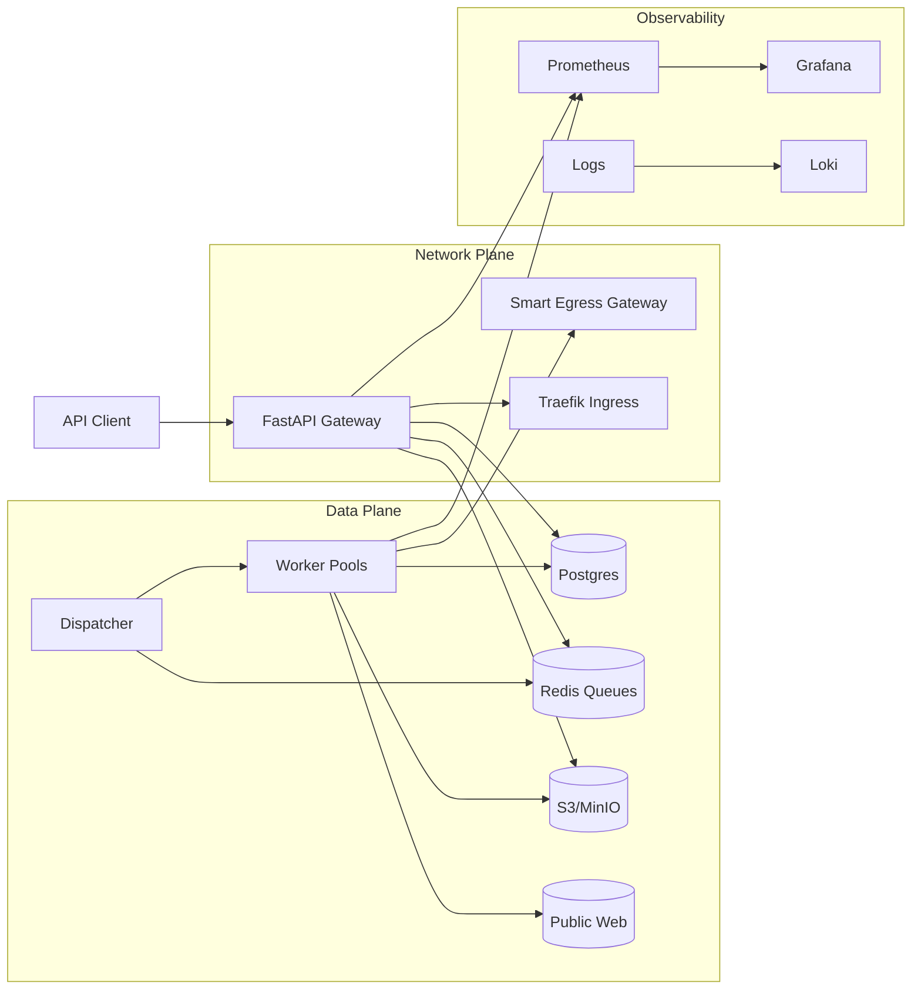
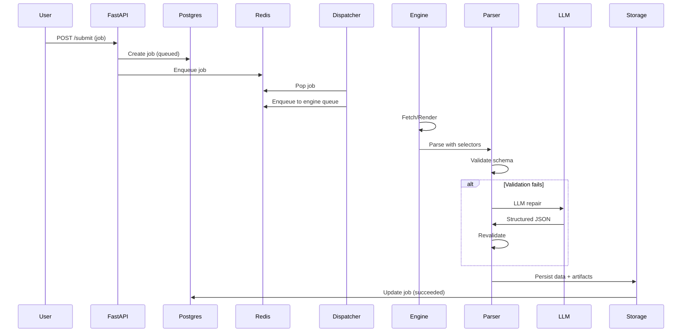
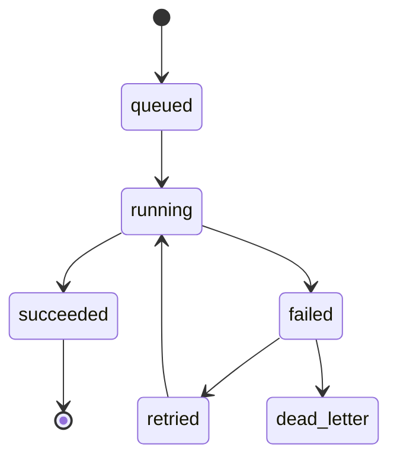

# Proteus-Scraper: Software Architecture

This document describes the detailed software architecture for Proteus-Scraper. It complements `project-overview.md` by defining components, data flow, contracts, and operational behavior.

## Goals
- Resilient extraction with selector-first speed and AI recovery.
- Deterministic data quality via schema validation.
- Horizontal scaling with global governance policies.
- Operational transparency (metrics, traces, artifacts).
- No-code configuration for selectors, routing, and policies.

## Non-Goals
- Internet-scale crawling.
- Bypassing legal or compliance requirements.
- Replacing downstream analytics or BI systems.

## System Context

## Architecture Layers

### Control Plane
- **API Gateway (FastAPI)**: Job submission, status, results, schema registry access.
- **Job Orchestrator**: Validates contracts, assigns priorities, and enqueues tasks.
- **Dispatcher**: Routes jobs to engine queues based on complexity and policies.
- **Config Registry**: Dynamic selectors, domain policies, identity pools.

### Data Plane
- **FastEngine** (Scrapy/HTTPX): Static pages, deterministic HTML.
- **BrowserEngine** (Playwright): JS-rendered SPAs and hydrated pages.
- **StealthEngine** (3rd-party APIs): High-friction targets.
- **Hybrid Parser**: Selector-first parsing with LLM fallback and validation.
- **Storage Worker**: Persists structured data and raw artifacts.

### Governance Plane
- **Global Rate Limiter**: Token bucket per domain across all workers.
- **Circuit Breaker**: Trip on ban spikes and cool down domains.
- **Cost Guardrails**: Per-job LLM spend caps and alerting.

### Intelligence Plane
- **Selector Registry**: Database-driven selector versions and promotions.
- **LLM Recovery**: Structured repair with Instructor and schema enforcement.
- **Ocular Module**: Local OCR and lightweight detection for visual content.

### Infrastructure Plane
- **Egress Gateway**: Centralized proxy routing with provider fallback.
- **Ingress**: Traefik for TLS termination and API routing.
- **Observability Stack**: Prometheus, Grafana, Loki.

## Component Responsibilities
| Component | Responsibility |
| --- | --- |
| API Gateway | Auth, validation, job creation, status, results |
| Dispatcher | Routing decisions, queue placement, policy checks |
| Engine Workers | Fetch, render, parse, artifact capture |
| Hybrid Parser | Selector parse, LLM fallback, revalidation |
| Storage Worker | Data persistence, artifact uploads |
| Selector Registry | Selector versions, candidate promotion |
| Identity Service | Session vault, fingerprints, rotation |
| Governance | Global limits, circuit breakers, cost caps |
| Egress Gateway | Proxy fallback, protocol translation, TLS handling |
| Observability | Metrics, logs, traces, dashboards |

## Data Flow (Sequence)

## Job State Machine

## Queue Design
- **Priority queues**: `high`, `standard`, `low`.
- **Engine queues**: `fast`, `browser`, `stealth`.
- **Dispatcher**: selects engine based on URL signals, domain risk, and budgets.
- **Backpressure**: throttle at queue ingestion when workers are saturated.

## API Surface (Summary)
- `POST /submit`: submit job with URL, schema_id, priority.
- `GET /status/{job_id}`: fetch state and progress.
- `GET /results/{job_id}`: structured data and artifact links.
- `POST /schemas`: register schema and validation rules.

## Hybrid Parsing and Self-Healing
- **Selector registry**: selectors stored in Postgres and fetched at runtime.
- **Candidate promotion**: LLM-derived selectors become candidates.
- **Verification**: promote after N successful validations.
- **Rollback**: demote on regression or drift.

## Identity and Session Management
- **Cookie Jar**: encrypted session vault in S3 or local disk.
- **Fingerprint pools**: user-agent, viewport, WebGL noise, locale.
- **Rotation**: usage count and failure-based rotation.
- **Isolation**: tenant-level separation of identities.

## Networking and Proxy Strategy
- **Egress gateway**: all worker traffic routes to `http://gateway:8080`.
- **Provider fallback**: automatic proxy failover.
- **Protocol translation**: SOCKS5/HTTP normalized upstream.
- **TLS termination**: stable TLS fingerprints at the gateway layer.

## Storage Model (Conceptual)
Core tables (simplified):
- `jobs`: id, url, state, priority, schema_id, tenant, created_at.
- `job_attempts`: job_id, engine, start_at, end_at, status, error.
- `artifacts`: job_id, type, location, checksum, created_at.
- `selectors`: schema_id, field, selector, version, active.
- `selector_candidates`: schema_id, field, selector, success_count.
- `identities`: tenant, profile_id, status, last_used_at.
- `domain_policies`: domain, rate_limit, breaker_threshold, cooldown.

## Observability
Prometheus metrics (examples):
- `proteus_jobs_total{state,engine,domain}`
- `proteus_job_duration_seconds{engine,domain}`
- `proteus_failures_total{reason,domain}`
- `proteus_llm_tokens_total{model}`
- `proteus_proxy_errors_total{provider}`
- `proteus_queue_depth{queue}`

Dashboards:
- Success rate per domain.
- Ban rate spikes (403/429).
- Proxy health by provider.
- LLM cost rate per tenant.
- Throughput and queue depth.

## Testing and Simulation
- **HAR replay**: parse without live traffic.
- **Mock targets**: containerized test site for pipeline validation.
- **Dry run**: run pipeline without DB writes or LLM calls.
- **Golden fixtures**: regression tests on known pages.

## Deployment and Scaling
- **Dev**: Docker Compose with a single API + worker pool.
- **Prod**: Kubernetes with KEDA autoscaling per queue.
- **Scaling**: separate worker pools for each engine.
- **Isolation**: per-tenant pools for high-value targets.

## Security and Compliance
- SSRF protection and URL allow/deny lists.
- Secrets stored in environment variables or secret manager.
- Audit logs for job submissions and identity usage.
- Optional robots.txt enforcement per tenant.

## Extensibility
- Add new engines or parsers via strategy interface.
- Custom domain policies and routing rules.
- Alternate storage backends (BigQuery, Snowflake).
- Additional LLM providers or local models.

## Risks and Mitigations
- **Selector drift**: mitigated by candidate promotion and rollback.
- **Cost overruns**: mitigated by LLM budgets and routing policies.
- **Ban waves**: mitigated by global governance and circuit breakers.
- **Data corruption**: mitigated by strict schema validation.
